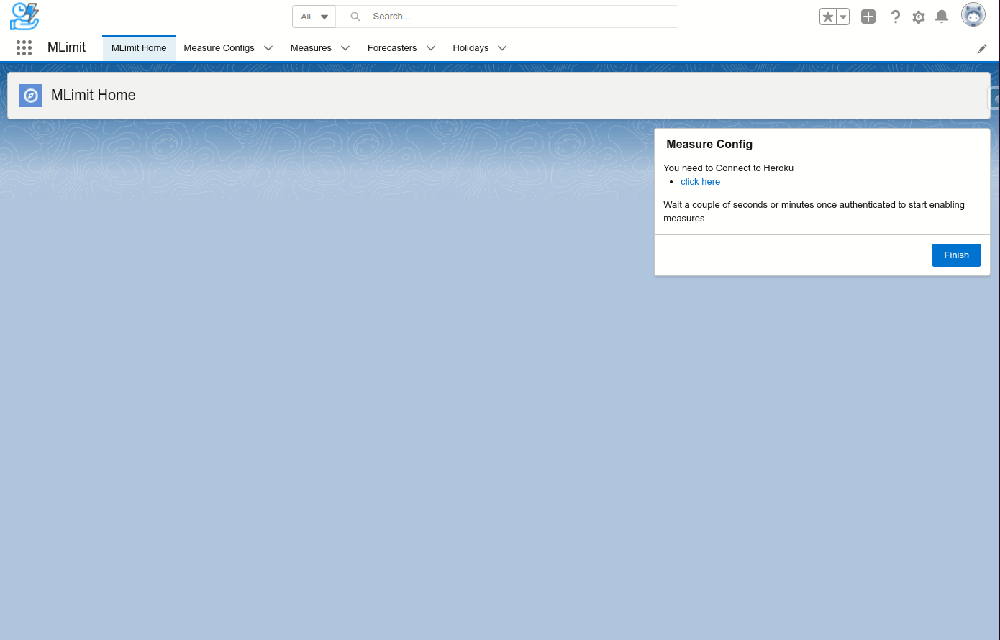
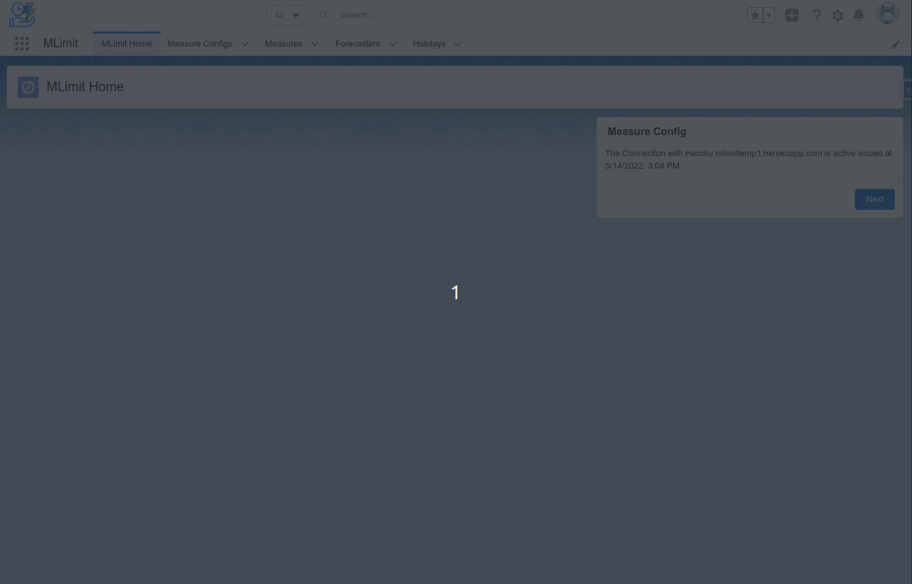

# MLimit Time Series Analysis with Salesforce Limits

MLimit is an open-source project for time series analysis and anomaly detection using [Merlion](https://github.com/salesforce/Merlion) a Python library for time series intelligence. This project aims to forecast the upward or downward trend of a Salesforce Organization governor [limits](https://developer.salesforce.com/docs/atlas.en-us.api_rest.meta/api_rest/resources_limits.htm) usage as time-dependent variables, trying to predict future data based on historical data. For example, the likelihood of data storage growth or API usage during the next seven days. Based on the prediction, evaluate actions such as improving resource utilization or acquiring more data storage.

This project is composed by multiple layers
- [Mlimit-merlion](https://github.com/MaurizioBella/mlimit-merlion) Core engine for the time-series-analsys.
- [mlimit-sf](https://github.com/MaurizioBella/mlimit-sf) Components needed to show the forecasted data in Salesforce acting a Presentation Layer.

#### Overview
- Configuration


- Measure and Forecaster


<!--
## Deploy it via GitHub
<a href="https://githubsfdeploy.herokuapp.com?owner=MaurizioBella&repo=mlimit-sf&ref=main">
  
</a>
-->

## Deploy it via DX Project
```sh
git clone https://github.com/MaurizioBella/mlimit-sf
cd mlimit-sf
sfdx force:org:create -f config/project-scratch-def.json -v <dev hub org alias> -a mlimit-sf --setdefaultusername # create new Scratch Org
# Example Output: Successfully created scratch org: 00D54000000OCquEAG, username: test-tnxg3fqufngn@example.com
node preRun.js --app <heroku app name>.herokuapp.com --user test-ttgfctaegrse@example.com # add the Heroku App Name you are going to create later and the username you just created
sfdx force:source:push -u mlimit-sf # push changes to the Scratch Org
sfdx force:user:permset:assign -n Mlimit_Admin -u mlimit-sf
sfdx force:org:open -u mlimit-sf
```
## Deploy Heroku 
- Go to the App Manager in the Scratch Org setup and take note of CONSUMER_KEY and CONSUMER_SECRET in the Connected App "MLimit". You need these details to deploy the Heroku application. 
- You are welcome now to deploy the Heroku (mlimit-merlion)[https://github.com/MaurizioBella/mlimit-merlion]
- Change the password in the Named Credential "mlimitcore" with the same value of the SECRET_KEY in Heroku once deployed the application

### Extra
- If you want to load some dummy data.
```sh
sfdx force:data:tree:import -u mlimit-sf \
    --plan data/export-demo-MeasureConfig__c-Forecaster__c-plan.json # Optional load some dummy data
```

mlimit-sf is available under the [MIT License](https://github.com/MaurizioBella/mlimit-sf/blob/main/LICENSE)
